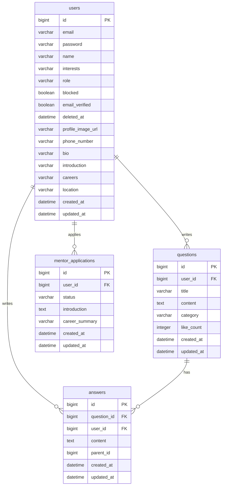

# MVP1

<aside>
💡

```mermaid
erDiagram
    users {
        bigint id PK
        varchar email
        varchar password
        varchar name
        varchar interests
        varchar role
        boolean blocked
        boolean email_verified
        datetime deleted_at
        varchar profile_image_url
        varchar phone_number
        varchar bio
		    varchar introduction
		    varchar careers
		    varchar location
        datetime created_at
        datetime updated_at
    }
    questions {
        bigint id PK
        bigint user_id FK
        varchar title
        text content
        varchar category
        integer like_count
        datetime created_at
        datetime updated_at
    }
    answers {
        bigint id PK
        bigint question_id FK
        bigint user_id FK
        text content
        bigint parent_id
        datetime created_at
        datetime updated_at
    }
    mentor_applications {
        bigint id PK
        bigint user_id FK
        varchar status
        text introduction
        varchar career_summary
        datetime created_at
        datetime updated_at
    }

    users ||--o{ questions : writes
    users ||--o{ answers : writes
    questions ||--o{ answers : has
    users ||--o{ mentor_applications : applies
    
```

</aside>

# MVP2

<aside>
💡

```mermaid
erDiagram
    users ||--o{ follows : follows
    users ||--o{ mentor_profiles : has
    users ||--o{ mentor_plan : sets
    users ||--o{ subscription : subscribes
    users ||--o{ mentor_post : writes
    users ||--o{ mentor_post_like : likes
    users ||--o{ chat_room : participates
    users ||--o{ notification : receives
    users ||--o{ mentor_review : writes
    users ||--o{ settlement_accounts : owns
    users ||--o{ settlements : earns
    users ||--o{ payment_methods : registers
    users ||--o{ email_verifications : requests
    users ||--o{ oauth_accounts : links
    users ||--o{ question_attachment_files : uploads
    mentor_plan ||--o{ subscription : has
    subscription ||--o{ payment : generates
    payment ||--o{ payment_cancellation : requests
    payment ||--o{ settlements : settles
    mentor_post ||--o{ mentor_post_like : liked_by
    mentor_post ||--o{ question_attachment_files : attaches
    chat_room ||--o{ chat_message : contains
    questions ||--o{ likes : liked_by
    users ||--o{ likes : likes
    mentor_post ||--o{ mentor_post_comments : has
    users ||--o{ mentor_post_comments : writes

    follows {
        bigint follow_id PK
        bigint follower_id FK
        bigint followee_id FK
        datetime created_at
    }
    mentor_profiles {
        bigint mentor_profile_id PK
        bigint user_id FK
        varchar bio
        varchar career
        varchar company
        varchar education
        varchar portfolio_url
        varchar schedule
        varchar tags
        datetime created_at
        datetime updated_at
    }
    mentor_plan {
        bigint id PK
        bigint mentor_id FK
        varchar plan_name
        varchar description
        integer price
        integer billing_cycle
        boolean is_active
        datetime created_at
        datetime updated_at
    }
    subscription {
        bigint id PK
        bigint user_id FK
        bigint mentor_id FK
        bigint plan_id FK
        bigint payment_method_id FK
        varchar status
        integer amount
        datetime current_period_start
        datetime current_period_end
        datetime next_billing_at
        datetime created_at
        datetime updated_at
    }
    payment_methods {
        bigint id PK
        bigint user_id FK
        varchar payment_provider
        varchar billing_key
        varchar card_brand
        varchar last4
        varchar card_nickname
        boolean is_default
        varchar payment_method_status
        datetime created_at
        datetime updated_at
    }
    payment {
        bigint id PK
        bigint subscription_id FK
        varchar payment_id
        varchar status
        bigint amount
        varchar currency
        integer cycle_no
        integer attempt_no
        varchar store_id
        varchar channel_key
        varchar schedule_id
        datetime paid_at
        datetime created_at
        datetime updated_at
    }
    payment_cancellation {
        bigint id PK
        bigint payment_id FK
        bigint requested_by_user_id
        varchar status
        bigint amount
        varchar reason
        varchar admin_note
        varchar cancellation_id
        datetime created_at
        datetime updated_at
    }
    mentor_post {
        bigint id PK
        bigint mentor_id FK
        varchar title
        text content
        varchar category
        boolean is_public
        bigint like_count
        bigint view_count
        datetime created_at
        datetime updated_at
    }
    mentor_post_like {
        bigint id PK
        bigint mentor_post_id FK
        bigint user_id FK
    }
    question_attachment_files {
        bigint id PK
        bigint question_id FK
        bigint mentor_post_id FK
        bigint uploader_id FK
        varchar attachment_type
        varchar attachment_status
        varchar storage_key
        varchar original_file_name
        bigint size
        datetime created_at
        datetime updated_at
    }
    chat_room {
        bigint id PK
        bigint mentor_id FK
        bigint subscriber_id FK
        bigint ended_by
        datetime created_at
    }
    chat_message {
        bigint id PK
        bigint chat_room_id FK
        bigint sender_id FK
        text content
        datetime created_at
    }
    notification {
        bigint id PK
        bigint recipient_id FK
        varchar type
        varchar message
        varchar link
        boolean is_read
        datetime created_at
    }
    mentor_review {
        bigint id PK
        bigint mentor_id FK
        bigint user_id FK
        integer rating
        varchar comment
        datetime created_at
        datetime updated_at
    }
    settlement_accounts {
        bigint id PK
        bigint user_id FK
        varchar bank_name
        varchar account_number
        varchar account_holder
        datetime created_at
        datetime updated_at
    }
    settlements {
        bigint id PK
        bigint mentor_id FK
        bigint payment_id FK
        varchar status
        bigint total_amount
        bigint pg_fee
        bigint platform_fee
        bigint net_amount
        datetime created_at
        datetime updated_at
    }
    email_verifications {
        bigint id PK
        bigint user_id FK
        varchar email
        varchar code
        datetime expires_at
        datetime created_at
        datetime updated_at
    }
    oauth_accounts {
        bigint id PK
        bigint user_id FK
        varchar provider
        varchar provider_user_id
    }
    likes {
        bigint like_id PK
        bigint question_id FK
        bigint user_id FK
        datetime created_at
    }
    mentor_post_comments {
        bigint id PK
        bigint post_id FK
        bigint user_id FK
        text content
        datetime created_at
    }
```

</aside>