# ERD
# MVP1

<aside>
💡

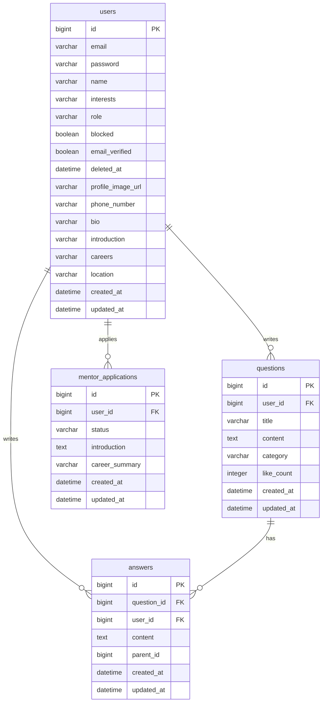

</aside>

# MVP2

<aside>
💡

```mermaid
erDiagram
    users ||--o{ follows : follows
    users ||--o{ mentor_profiles : has
    users ||--o{ mentor_plan : sets
    users ||--o{ subscription : subscribes
    users ||--o{ mentor_post : writes
    users ||--o{ mentor_post_like : likes
    users ||--o{ chat_room : participates
    users ||--o{ notification : receives
    users ||--o{ mentor_review : writes
    users ||--o{ settlement_accounts : owns
    users ||--o{ settlements : earns
    users ||--o{ payment_methods : registers
    users ||--o{ email_verifications : requests
    users ||--o{ oauth_accounts : links
    users ||--o{ question_attachment_files : uploads
    mentor_plan ||--o{ subscription : has
    subscription ||--o{ payment : generates
    payment ||--o{ payment_cancellation : requests
    payment ||--o{ settlements : settles
    mentor_post ||--o{ mentor_post_like : liked_by
    mentor_post ||--o{ question_attachment_files : attaches
    chat_room ||--o{ chat_message : contains

    follows {
        bigint follow_id PK
        bigint follower_id FK
        bigint followee_id FK
        datetime created_at
    }
    mentor_profiles {
        bigint mentor_profile_id PK
        bigint user_id FK
        varchar bio
        varchar career
        varchar company
        varchar education
        varchar portfolio_url
        varchar schedule
        varchar tags
        datetime created_at
        datetime updated_at
    }
    mentor_plan {
        bigint id PK
        bigint mentor_id FK
        varchar plan_name
        varchar description
        integer price
        integer billing_cycle
        boolean is_active
        datetime created_at
        datetime updated_at
    }
    subscription {
        bigint id PK
        bigint user_id FK
        bigint mentor_id FK
        bigint plan_id FK
        bigint payment_method_id FK
        varchar status
        integer amount
        datetime current_period_start
        datetime current_period_end
        datetime next_billing_at
        datetime created_at
        datetime updated_at
    }
    payment_methods {
        bigint id PK
        bigint user_id FK
        varchar payment_provider
        varchar billing_key
        varchar card_brand
        varchar last4
        varchar card_nickname
        boolean is_default
        varchar payment_method_status
        datetime created_at
        datetime updated_at
    }
    payment {
        bigint id PK
        bigint subscription_id FK
        varchar payment_id
        varchar status
        bigint amount
        varchar currency
        integer cycle_no
        integer attempt_no
        varchar store_id
        varchar channel_key
        varchar schedule_id
        datetime paid_at
        datetime created_at
        datetime updated_at
    }
    payment_cancellation {
        bigint id PK
        bigint payment_id FK
        bigint requested_by_user_id
        varchar status
        bigint amount
        varchar reason
        varchar admin_note
        varchar cancellation_id
        datetime created_at
        datetime updated_at
    }
    mentor_post {
        bigint id PK
        bigint mentor_id FK
        varchar title
        text content
        varchar category
        boolean is_public
        bigint like_count
        bigint view_count
        datetime created_at
        datetime updated_at
    }
    mentor_post_like {
        bigint id PK
        bigint mentor_post_id FK
        bigint user_id FK
    }
    question_attachment_files {
        bigint id PK
        bigint question_id FK
        bigint mentor_post_id FK
        bigint uploader_id FK
        varchar attachment_type
        varchar attachment_status
        varchar storage_key
        varchar original_file_name
        bigint size
        datetime created_at
        datetime updated_at
    }
    chat_room {
        bigint id PK
        bigint mentor_id FK
        bigint subscriber_id FK
        bigint ended_by
        datetime created_at
    }
    chat_message {
        bigint id PK
        bigint chat_room_id FK
        bigint sender_id FK
        text content
        datetime created_at
    }
    notification {
        bigint id PK
        bigint recipient_id FK
        varchar type
        varchar message
        varchar link
        boolean is_read
        datetime created_at
    }
    mentor_review {
        bigint id PK
        bigint mentor_id FK
        bigint user_id FK
        integer rating
        varchar comment
        datetime created_at
        datetime updated_at
    }
    settlement_accounts {
        bigint id PK
        bigint user_id FK
        varchar bank_name
        varchar account_number
        varchar account_holder
        datetime created_at
        datetime updated_at
    }
    settlements {
        bigint id PK
        bigint mentor_id FK
        bigint payment_id FK
        varchar status
        bigint total_amount
        bigint pg_fee
        bigint platform_fee
        bigint net_amount
        datetime created_at
        datetime updated_at
    }
    email_verifications {
        bigint id PK
        bigint user_id FK
        varchar email
        varchar code
        datetime expires_at
        datetime created_at
        datetime updated_at
    }
    oauth_accounts {
        bigint id PK
        bigint user_id FK
        varchar provider
        varchar provider_user_id
    }
    questions ||--o{ likes : liked_by
    users ||--o{ likes : likes
    mentor_post ||--o{ mentor_post_comments : has
    users ||--o{ mentor_post_comments : writes

    likes {
        bigint like_id PK
        bigint question_id FK
        bigint user_id FK
        datetime created_at
    }
    mentor_post_comments {
        bigint id PK
        bigint post_id FK
        bigint user_id FK
        text content
        datetime created_at
    }
    inquiries {
        bigint id PK
        varchar category
        varchar email
        varchar title
        text content
        varchar status
        datetime created_at
    }
```

</aside>

# API 명세서
## MVP 1

**인증**

| API | 설명 | 요청 | 응답 | 인증/권한 | 예외 |
| --- | --- | --- | --- | --- | --- |
| POST /api/auth/signup | 회원가입 | Body: email, password, name | 201 {id,email,name,role} | GUEST | 400 형식오류(email·password·name) · 409 이메일 중복 |
| POST /api/auth/login | 로그인 | Body: email, password | 200 {accessToken}(refreshToken은 쿠키) | GUEST | 401 이메일/비밀번호 불일치 |
| POST /api/auth/refresh | 토큰 재발급 | Cookie: refreshToken | 200 {accessToken}(쿠키 갱신) | GUEST | 401 refreshToken 만료·불일치 |
| POST /api/auth/logout | 로그아웃 | Cookie: refreshToken | 204 | USER | 401 |

**소셜 로그인 (OAuth2)**

| API | 설명 | 요청 | 응답 | 인증/권한 | 예외 |
| --- | --- | --- | --- | --- | --- |
| GET /oauth2/authorization/{provider} | 소셜 로그인 시작 (provider: google, kakao) | - | 302 provider 인증 페이지로 리다이렉트 | GUEST | - |
| GET /login/oauth2/code/{provider} | 소셜 로그인 콜백 (Spring Security 내장, provider가 호출) | Query: code 등(provider 발급) | 302 accessToken 없이 프론트 콜백 URL로 리다이렉트 + refreshToken을 `/api/auth` 경로 쿠키로 심음 | GUEST | 302 실패 시 실패 URL로 리다이렉트(`OAuth2FailureHandler`) |

**프로필**

| API | 설명 | 요청 | 응답 | 인증/권한 | 예외 |
| --- | --- | --- | --- | --- | --- |
| GET /api/users/me | 내 정보 조회 | - | 200 {id,email,name,interests,role,emailVerified,...} | USER | 401 |
| PATCH /api/users/me | 프로필(이름·관심사) 수정 | Body: name, interests | 200 수정된 프로필 | USER | 400 name 형식오류(1~20자) |
| PATCH /api/users/me/email | 이메일 수정 | Body: email | 200 수정된 프로필 | USER | 400 이메일 형식오류 |
| PATCH /api/users/me/password | 비밀번호 수정 | Body: currentPassword, newPassword | 200 수정된 프로필 | USER | 400 현재 비밀번호 불일치 · 400 새 비밀번호 8자 미만 |
| DELETE /api/users/me | 회원 탈퇴 | - | 204 | USER | 401 |
| GET /api/users/{userId} | 타인 프로필 공개 조회 | - | 200 {id,name,profileImageUrl,followerCount,followingCount,isFollowing} | GUEST | 404 유저 없음 |

**질문**

| API | 설명 | 요청 | 응답 | 인증/권한 | 예외 |
| --- | --- | --- | --- | --- | --- |
| POST /api/questions | 질문 등록 | Body: title, content, category, attachmentIds | 201 질문 객체 | USER | 400 title(1~100자)·content(1~20000자)·category 형식오류 |
| GET /api/questions | 질문 목록 조회 | Query: page, size | 200 {content, page, size, totalElements} | GUEST | - |
| GET /api/questions/{questionId} | 질문 상세 조회(답변 포함) | - | 200 질문+답변 목록 | GUEST | 404 질문 없음 |
| PATCH /api/questions/{questionId} | 질문 수정 | Body: title, content, category, attachmentIds | 200 수정된 질문 | USER(본인)·ADMIN | 400 형식오류 · 403 · 404 |
| DELETE /api/questions/{questionId} | 질문 삭제 | - | 204 | USER(본인)·ADMIN | 403 · 404 |

**답변**

| API | 설명 | 요청 | 응답 | 인증/권한 | 예외 |
| --- | --- | --- | --- | --- | --- |
| POST /api/questions/{questionId}/answers | 답변 등록 | Body: content, parentId | 201 답변 객체 | USER | 400 content 형식오류(1~2000자) · 404 질문 없음 |
| PATCH /api/answers/{answerId} | 답변 수정 | Body: content | 200 수정된 답변 | USER(본인)·ADMIN | 403 · 404 |
| DELETE /api/answers/{answerId} | 답변 삭제 | - | 204 | USER(본인)·ADMIN | 403 · 404 |

**멘토 신청**

| API | 설명 | 요청 | 응답 | 인증/권한 | 예외 |
| --- | --- | --- | --- | --- | --- |
| POST /api/users/me/mentor/application | 멘토 신청 | - | 200 | USER | 409 이미 대기중 신청 존재 |
| GET /api/users/me/mentor/application | 본인 신청 상태 조회 | - | 200 {status, dateTime} | USER | 404 신청 이력 없음 |
| GET /api/admin/mentors/applications | 신청 대기 목록 조회 | - | 200 [유저 목록] | ADMIN | 403 |
| PATCH /api/admin/mentors/{userId}/approval | 신청 승인 | - | 200 | ADMIN | 403 · 404 |
| PATCH /api/admin/mentors/{userId}/rejection | 신청 거절 | - | 200 | ADMIN | 403 · 404 |

**회원 관리(관리자)**

| API | 설명 | 요청 | 응답 | 인증/권한 | 예외 |
| --- | --- | --- | --- | --- | --- |
| DELETE /api/admin/users/{userId} | 회원 강제 삭제(하드, CASCADE) | - | 200 | ADMIN | 403 · 404 |

# MVP 2

**팔로우 · 피드 · 좋아요**

| API | 설명 | 요청 | 응답 | 인증/권한 | 예외 |
| --- | --- | --- | --- | --- | --- |
| POST /api/users/{userId}/follow | 팔로우/언팔로우 토글 | - | 200 | USER | 401 |
| GET /api/questions/following | 팔로우한 유저의 질문 피드 | Query: page, size | 200 {content,...} | USER | 401 |
| POST /api/v1/mentors/{mentorId}/posts/{postId}/likes | 게시글 좋아요 | - | 200 | USER | 401 |
| DELETE /api/v1/mentors/{mentorId}/posts/{postId}/likes | 좋아요 취소 | - | 200 | USER | 401 |
| POST /api/questions/{questionId}/like | 질문 좋아요 토글 | - | 200 {isLiked, likeCount} | USER | 401 |

**멘토 목록 · 프로필 · 리뷰**

| API | 설명 | 요청 | 응답 | 인증/권한 | 예외 |
| --- | --- | --- | --- | --- | --- |
| GET /api/mentors | 멘토 목록 조회·검색 | Query: keyword, page, size | 200 {content,...} | USER | 401 |
| GET /api/mentors/{mentorId} | 멘토 상세 조회 | - | 200 멘토 프로필 객체 | USER | 401 · 404 |
| PUT /api/mentors/{mentorId} | 멘토 프로필 등록·수정 | Body: bio, company, career, tags, education, schedule, subscriptionPrice, portfolioUrl | 200 수정된 프로필 | MENTOR(본인) | 403 |
| GET /api/mentors/{mentorId}/reviews | 리뷰 목록 조회 | - | 200 [리뷰 목록] | USER | 401 |
| POST /api/mentors/{mentorId}/reviews | 리뷰 작성·수정(덮어쓰기) | Body: rating(1~5), comment(최대 1000자) | 201 리뷰 객체 | USER(구독 이력 필요) | 400 rating 범위 초과 · 403 구독 이력 없음 |
| DELETE /api/mentors/{mentorId}/reviews/{reviewId} | 리뷰 삭제 | - | 204 | USER(본인) | 403 |
| GET /api/mentors/me/dashboard/** | 멘토 대시보드 조회 | - | 200 대시보드 데이터 | MENTOR(본인) | 401 |

**멘토 신청 - 이메일 인증**

| API | 설명 | 요청 | 응답 | 인증/권한 | 예외 |
| --- | --- | --- | --- | --- | --- |
| POST /api/users/me/email/verification-code | 인증번호 발송 | Body: email | 200 | USER | 409 이미 사용중인 이메일 |
| POST /api/users/me/email/verify | 인증번호 검증 | Body: email, code | 200 인증 완료된 프로필 | USER | 400 코드 불일치·만료(5분) |

**구독 · 결제**

| API | 설명 | 요청 | 응답 | 인증/권한 | 예외 |
| --- | --- | --- | --- | --- | --- |
| GET /api/v1/subscriptions/check?mentorId= | 구독 권한(페이월) 확인 | Query: mentorId | 200 {accessAllowed} | USER | 401 |
| POST /api/v1/subscriptions?planid= | 구독 신청(등록 카드로 즉시 결제) | Query: planid, Body: mentorId | 201 결제 결과 객체 | USER | 400 결제 실패 |
| GET /api/v1/subscriptions/me | 내 구독 목록 조회 | - | 200 [구독 목록] | USER | 401 |
| GET /api/v1/subscriptions/{subscriptionId}/payments | 구독별 결제 내역 조회 | - | 200 [결제 내역] | USER(본인) | 400(본인 아님·구독 없음 — 403 아님) |
| PATCH /api/v1/subscriptions/{subscriptionId}/cancel | 구독 해지 신청 | - | 200 | USER(본인) | 400(본인 아님·구독 없음 — `IllegalArgumentException`이 400으로 매핑됨, 403 아님) |
| POST /api/v1/mentors/{mentorId}/plans | 요금제 등록 | Body: planName, description, price, billingCycle | 201 요금제 객체 | MENTOR(본인) | 400 price·planName 형식오류 · 403 |
| GET /api/v1/mentors/{mentorId}/plans | 요금제 목록 조회 | - | 200 [요금제 목록] | USER | 401 |
| PUT /api/v1/mentors/{mentorId}/plans/{planId} | 요금제 수정 | Body: planName, description, price, billingCycle | 200 수정된 요금제 | MENTOR(본인) | 403 |
| DELETE /api/v1/mentors/{mentorId}/plans/{planId} | 요금제 삭제(비활성화) | - | 204 | MENTOR(본인) | 403 |
| POST /api/payment-methods/prepare | 빌링키 발급 준비 | - | 200 {issueId,...} | USER | 401 |
| POST /api/payment-methods | 결제수단 등록 | Body: cardNickname, issueId, billingKey, phoneNumber | 201 결제수단 객체 | USER | 400 필수값 누락 |
| GET /api/payment-methods | 결제수단 목록 조회 | - | 200 [결제수단 목록] | USER | 401 |
| PATCH /api/payment-methods/{id}/default | 기본 결제수단 설정 | - | 200 | USER(본인) | 403 |
| DELETE /api/payment-methods/{id} | 결제수단 삭제 | - | 204 | USER(본인) | 403 |
| POST /api/v1/payments/{paymentId}/complete | 결제 완료 검증 | - | 200 결제 결과 객체 | USER | 400 결제 검증 실패 |
| POST /api/v1/payments/{paymentId}/cancellations | 환불 요청 | Body: reason | 201 환불 요청 객체 | USER | 400 사유 누락 |
| GET /api/v1/payments/cancellations/me | 내 환불 요청 이력 조회 | - | 200 [환불 이력] | USER | 401 |

**멘토 전용 게시판**

| API | 설명 | 요청 | 응답 | 인증/권한 | 예외 |
| --- | --- | --- | --- | --- | --- |
| GET /api/v1/mentors/{mentorId}/posts | 게시글 목록 조회(비구독자 잠금) | - | 200 [게시글 목록(잠금 표시 포함)] | GUEST | - |
| POST /api/v1/mentors/{mentorId}/posts | 게시글 작성 | Body: title, content, category, isPublic, attachmentIds | 201 게시글 객체 | MENTOR(본인) | 403 |
| GET /api/v1/mentors/{mentorId}/posts/{postId} | 게시글 상세 조회 | - | 200 게시글 객체 | 구독자·MENTOR(본인) | 403 미구독 · 404 |
| PUT /api/v1/mentors/{mentorId}/posts/{postId} | 게시글 수정 | Body: title, content, category, isPublic, attachmentIds | 200 수정된 게시글 | MENTOR(본인) | 400(본인 아님·게시글 없음 — `IllegalArgumentException`이 400으로 매핑됨, 403 아님. 같은 컨트롤러의 삭제는 정상적으로 403/404를 낸다) |
| DELETE /api/v1/mentors/{mentorId}/posts/{postId} | 게시글 삭제 | - | 200 | MENTOR(본인) | 403 |
| GET /api/v1/mentors/{mentorId}/posts/{postId}/comments | 댓글 목록 조회 | - | 200 [댓글 목록] | GUEST | - |
| POST /api/v1/mentors/{mentorId}/posts/{postId}/comments | 댓글 작성 | Body: content | 201 댓글 객체 | USER | 401 |
| DELETE /api/v1/mentors/{mentorId}/posts/{postId}/comments/{commentId} | 댓글 삭제 | - | 204 | USER(본인) | 403 |

**멘토 1:1 채팅**

| API | 설명 | 요청 | 응답 | 인증/권한 | 예외 |
| --- | --- | --- | --- | --- | --- |
| POST /api/v1/mentors/{mentorId}/chat-room | 채팅방 생성·재활성화 | - | 200 채팅방 객체 | 구독자 | 403 미구독 |
| GET /api/v1/chat-rooms/me | 내 채팅방 목록 조회 | - | 200 [채팅방 목록] | USER | 401 |
| POST /api/v1/chat-rooms/{roomId}/messages | 메시지 전송 | Body: content | 201 메시지 객체 | 참여자 | 403 · 404 |
| GET /api/v1/chat-rooms/{roomId}/messages | 메시지 목록 조회 | - | 200 [메시지 목록] | 참여자 | 403 |
| DELETE /api/v1/chat-rooms/{roomId} | 채팅 종료(본인에게만 숨김) | - | 204 | 참여자 | 403 |

**정산**

| API | 설명 | 요청 | 응답 | 인증/권한 | 예외 |
| --- | --- | --- | --- | --- | --- |
| GET /api/v1/settlement-accounts/me | 정산 계좌 조회 | - | 200 계좌 객체 | MENTOR(본인) | 401 |
| POST /api/v1/settlement-accounts/me | 정산 계좌 등록·수정 | Body: bankName, accountNumber, accountHolder | 200 계좌 객체 | MENTOR(본인) | 400 형식오류(자릿수·자모분리) |
| GET /api/v1/settlements/me | 정산 내역 조회 | - | 200 [정산 목록] | MENTOR(본인) | 401 |
| POST /api/v1/settlements/me/request-withdrawal | 출금 신청 | - | 200 | MENTOR(본인) | 400 출금 가능 금액 없음 |
| GET /api/admin/settlements | 전체 정산 목록 조회 | - | 200 [정산 목록] | ADMIN | 403 |
| PATCH /api/admin/settlements/{id}/complete | 정산(출금) 완료 처리 | - | 200 | ADMIN | 403 |

**알림**

| API | 설명 | 요청 | 응답 | 인증/권한 | 예외 |
| --- | --- | --- | --- | --- | --- |
| GET /api/v1/notifications | 알림 목록 조회 | Query: page, size | 200 [알림 목록] | USER | 401 |
| GET /api/v1/notifications/unread-count | 안읽은 알림 개수 조회 | - | 200 {count} | USER | 401 |
| PATCH /api/v1/notifications/{notificationId}/read | 알림 읽음 처리 | - | 200 | USER(본인) | 403 |
| PATCH /api/v1/notifications/read-all | 전체 읽음 처리 | - | 200 | USER | 401 |
| DELETE /api/v1/notifications/read | 읽은 알림 일괄 삭제 | - | 204 | USER | 401 |
| DELETE /api/v1/notifications/{notificationId} | 알림 삭제 | - | 204 | USER(본인) | 403 |

**관리자(회원·환불)**

| API | 설명 | 요청 | 응답 | 인증/권한 | 예외 |
| --- | --- | --- | --- | --- | --- |
| GET /api/admin/users | 전체 회원 목록 조회 | - | 200 [회원 목록] | ADMIN | 403 |
| GET /api/admin/users/search | 회원 검색·필터·페이지네이션 | Query: page, size, keyword, role, sort | 200 {content,...} | ADMIN | 403 |
| PATCH /api/admin/users/{userId}/block | 회원 차단 | - | 200 | ADMIN | 403 |
| PATCH /api/admin/users/{userId}/unblock | 회원 차단 해제 | - | 200 | ADMIN | 403 |
| GET /api/admin/cancellations | 환불 요청 목록 조회 | - | 200 [환불 목록] | ADMIN | 403 |
| PATCH /api/admin/cancellations/{id}/approve | 환불 승인 | - | 200 | ADMIN | 403 |
| PATCH /api/admin/cancellations/{id}/reject | 환불 거절 | Body: adminNote | 200 | ADMIN | 403 |

**1:1 문의 · 첨부파일**

| API | 설명 | 요청 | 응답 | 인증/권한 | 예외 |
| --- | --- | --- | --- | --- | --- |
| POST /api/v1/inquiries | 문의 등록 | Body: category, email, title, content | 200 | GUEST | 400 필수값 누락 |
| GET /api/admin/inquiries | 문의 목록 조회 | - | 200 [문의 목록] | ADMIN | 403 |
| PATCH /api/admin/inquiries/{id}/status | 문의 상태 변경 | Body: status | 200 | ADMIN | 403 |
| POST /api/attachments/images/signature | 이미지 업로드 서명 발급 | - | 200 {signature,...} | USER | 401 |
| POST /api/attachments/profile-image/signature | 프로필 이미지 업로드 서명 발급 | - | 200 {signature,...} | USER | 401 |
| POST /api/attachments/files | 파일 업로드 | Body(form-data): file | 201 파일 객체 | USER | 400 |
| GET /api/attachments/files/{attachId}/download | 파일 다운로드 | - | 200 파일 스트림 | 소유자 | 403 |

# 시퀀스 다이어그램

# MVP1: 로그인 및 JWT 토큰 발급

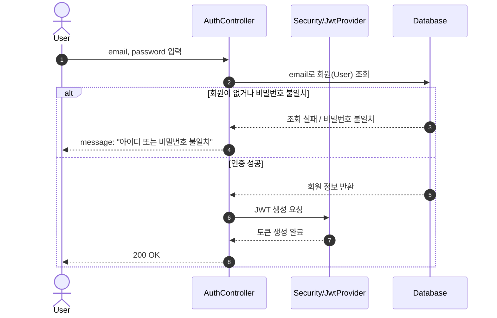

# **MVP1: 멘토 신청 및 관리자 승인/거절**

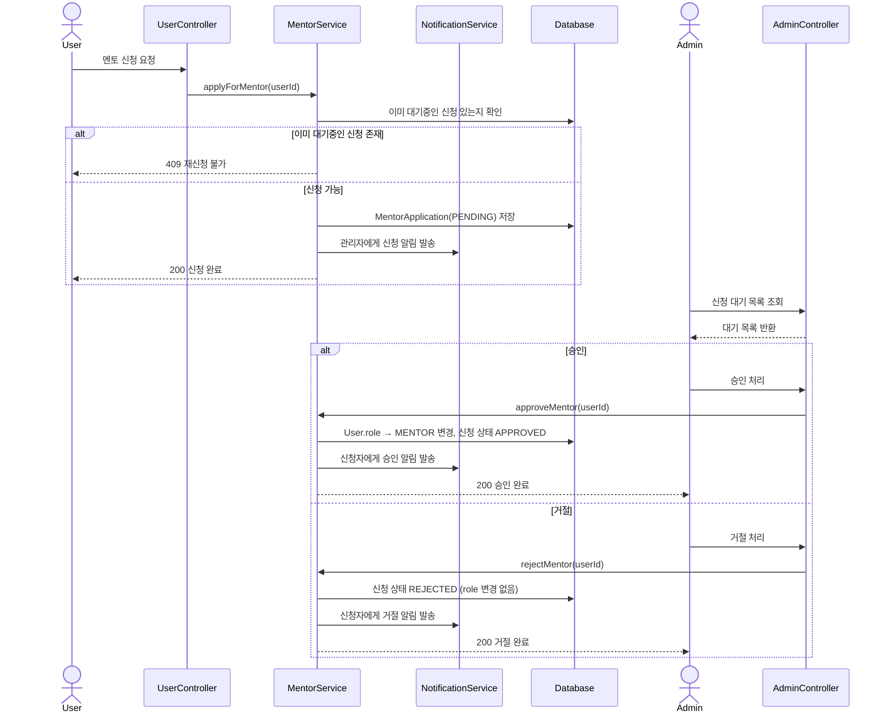

# **MVP2: 결제수단(빌링키) 등록**

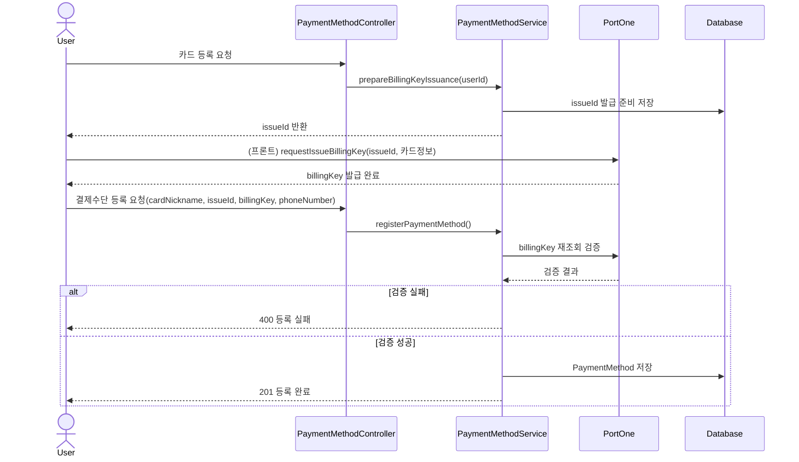

# **MVP2: 구독 신청 및 최초 결제**

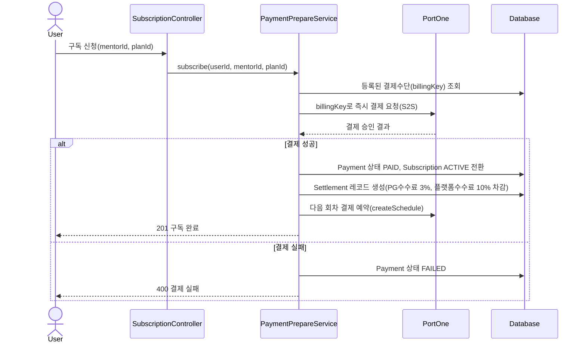

# **MVP2: 정기 결제 자동 갱신**

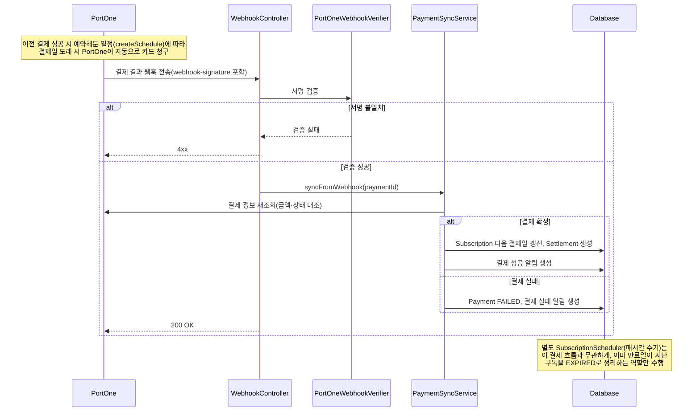

# **MVP2: 채팅방 생성 및 재활성화**

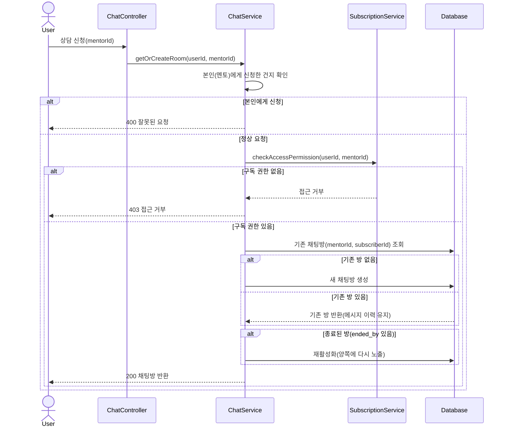

# **MVP2: 구독자 전용 게시글(멘토 게시판) 조회 — 페이월 체크**

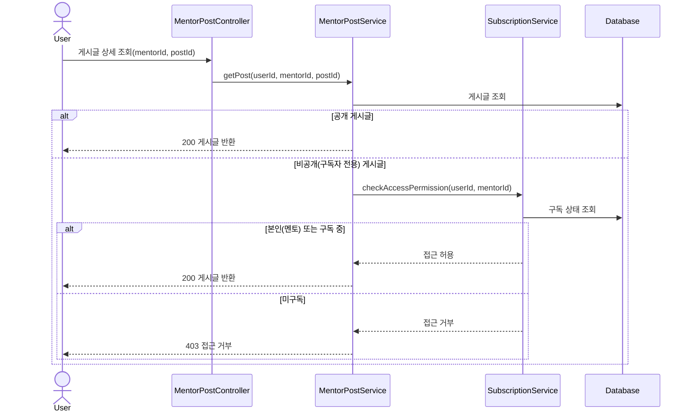

# **MVP2: 환불 요청 및 관리자 승인 처리**

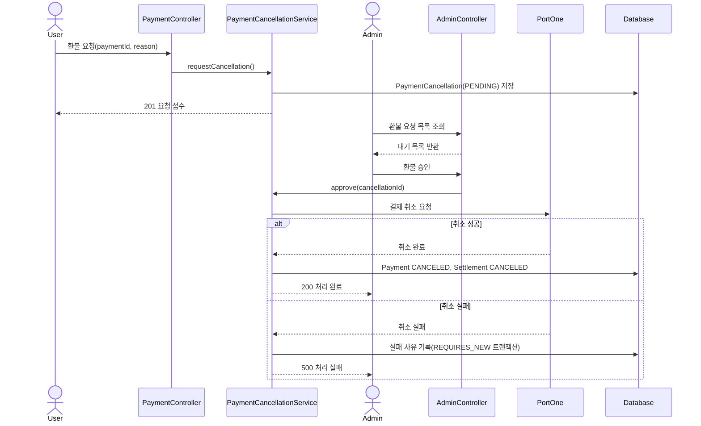

# **MVP2: 멘토 정산 출금 신청 및 관리자 완료 처리**

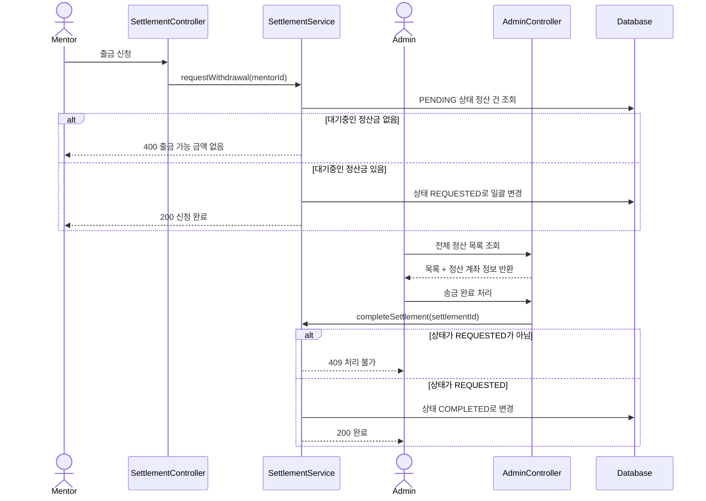

# 권한 매트릭스

MVP 1

**1. 인증·계정·질문·답변·멘토신청**

| **API/기능** | **GUEST** | **USER** | **MENTOR** | **ADMIN** |
| --- | --- | --- | --- | --- |
| F-01. 회원가입 (`POST /api/auth/signup`) | O | O | O | O |
| F-02. 로그인 (`POST /api/auth/login`) | O | O | O | O |
| F-02. 토큰 재발급 (`POST /api/auth/refresh`) | O(refreshToken 쿠키 필요) | O | O | O |
| F-02. 로그아웃 (`POST /api/auth/logout`) | 401 | O | O | O |
| F-10. 내 프로필 조회 (`GET /api/users/me`) | 401 | O(본인) | O(본인) | O(본인) |
| F-11. 프로필(이름·관심사) 수정 (`PATCH /api/users/me`) | 401 | O(본인) | O(본인) | O(본인) |
| F-11. 이메일 수정 (`PATCH /api/users/me/email`) | 401 | O(본인) | O(본인) | O(본인) |
| F-11. 비밀번호 수정 (`PATCH /api/users/me/password`) | 401 | O(본인) | O(본인) | O(본인) |
| F-12. 회원 탈퇴 (`DELETE /api/users/me`) | 401 | O(본인) | O(본인) | O(본인) |
| F-03. 질문 작성 (`POST /api/questions`) | 401 | O | O | O |
| F-04. 질문 목록 조회 (`GET /api/questions`) | O | O | O | O |
| F-05. 질문 상세 조회 (`GET /api/questions/{id}`) | O | O | O | O |
| F-06. 질문 수정 (`PATCH /api/questions/{id}`) | 401 | O(본인만, ADMIN 우회 없음) | O(본인만) | O(본인만) |
| F-06. 질문 삭제 (`DELETE /api/questions/{id}`) | 401 | O(본인 및 ADMIN) | O(본인 및 ADMIN) | O(본인 및 ADMIN) |
| F-07. 답변 작성 (`POST /api/questions/{id}/answers`) | 401 | O | O | O |
| F-05. 답변 목록 조회 (`GET /api/questions/{id}/answers`, 질문 상세에 포함) | O | O | O | O |
| F-08. 답변 수정 (`PATCH /api/answers/{id}`) | 401 | O(본인만, ADMIN 우회 없음) | O(본인만) | O(본인만) |
| F-08. 답변 삭제 (`DELETE /api/answers/{id}`) | 401 | O(본인 및 ADMIN) | O(본인 및 ADMIN) | O(본인 및 ADMIN) |
| F-13. 멘토 신청 (`POST /api/users/me/mentor/application`) | 401 | O(본인) | 400(이미 멘토) | 400(대상 아님) |
| F-14. 멘토 신청 본인 조회 (`GET /api/users/me/mentor/application`) | 401 | O(본인) | O(본인) | O(본인) |
| F-15. 멘토 신청 대기 목록 조회 (`GET /api/admin/mentors/applications`) | 401 | 403 | 403 | O |
| F-16. 멘토 신청 승인 (`PATCH /api/admin/mentors/{userId}/approval`) | 401 | 403 | 403 | O |
| F-17. 멘토 신청 거절 (`PATCH /api/admin/mentors/{userId}/rejection`) | 401 | 403 | 403 | O |

MVP 2

**회원(User)**

| **API/기능** | **GUEST** | **USER** | **MENTOR** | **ADMIN** |
| --- | --- | --- | --- | --- |
| F-21. 공개 프로필 조회 (`GET /api/users/{userId}`) | O | O | O | O |
| F-23. 팔로우/언팔로우 토글 (`POST /api/users/{userId}/follow`) | 401 | O(자기 자신 대상은 400) | O | O |
| F-40. 이메일 인증코드 발송 (`POST /api/users/me/email/verification-code`) | 401 | O(본인) | O(본인) | O(본인) |
| F-40. 이메일 인증코드 검증 (`POST /api/users/me/email/verify`) | 401 | O(본인) | O(본인) | O(본인) |

**질문(Question)**

| **API/기능** | **GUEST** | **USER** | **MENTOR** | **ADMIN** |
| --- | --- | --- | --- | --- |
| F-50. 질문 좋아요 토글 (`POST /api/questions/{id}/like`) | 401 | O | O | O |
| F-24. 팔로잉 피드 (`GET /api/questions/following`) | 401(컨트롤러 자체 가드) | O(본인) | O(본인) | O(본인) |

**멘토(Mentor)**

| **API/기능** | **GUEST** | **USER** | **MENTOR** | **ADMIN** |
| --- | --- | --- | --- | --- |
| F-41. 멘토 목록 조회 (`GET /api/mentors`) | 401 | O | O | O |
| F-41. 멘토 상세 조회 (`GET /api/mentors/{mentorId}`) | 401 | O | O | O |
| F-33. 멘토 프로필 수정 (`PUT /api/mentors/{mentorId}`) | 401 | O(본인) | O(본인) | O(본인) |
| F-38. 멘토 리뷰 목록 조회 (`GET /api/mentors/{mentorId}/reviews`) | 401 | O | O | O |
| F-38. 멘토 리뷰 작성 (`POST /api/mentors/{mentorId}/reviews`) | 401 | O(해당 멘토 구독 이력 필요, 없으면 403 / 본인 대상 400) | O(구독 이력 필요) | O(구독 이력 필요) |
| F-38. 멘토 리뷰 삭제 (`DELETE /api/mentors/{mentorId}/reviews/{reviewId}`) | 401 | O(본인만, ADMIN 우회 없음) | O(본인만) | O(본인만) |

**멘토 대시보드**

| **API/기능** | **GUEST** | **USER** | **MENTOR** | **ADMIN** |
| --- | --- | --- | --- | --- |
| F-43. 대시보드 — 요약/트렌드/평점분포/프로필완성도/최근글/최근리뷰/구독자/환불/결제내역 (`GET .../summary` 외 8개) | 401 | 403 | O(본인만, 항상 JWT 기준) | 403 |

#### **멘토 요금제(Plan)**

| **API/기능** | **GUEST** | **USER** | **MENTOR** | **ADMIN** |
| --- | --- | --- | --- | --- |
| F-42. 요금제 목록 조회 (`GET /api/v1/mentors/{mentorId}/plans`) | 401 | O | O | O |
| F-42. 요금제 단건 조회 (`GET .../plans/{planId}`) | 401 | O | O | O |
| F-42. 요금제 등록 (`POST .../plans`) | 401 | O(본인, 정산계좌 미등록 시 400) | O(본인, 정산계좌 필요) | O(본인, 정산계좌 필요) |
| F-42. 요금제 수정 (`PUT .../plans/{planId}`) | 401 | O(본인만) | O(본인만) | O(본인만) |
| F-42. 요금제 삭제/비활성화 (`DELETE .../plans/{planId}`) | 401 | O(본인만) | O(본인만) | O(본인만) |

**멘토 아티클(Post) — F-31, F-32**

| **API/기능** | **GUEST** | **USER** | **MENTOR** | **ADMIN** |
| --- | --- | --- | --- | --- |
| F-31. 아티클 작성 (`POST /api/v1/mentors/{mentorId}/posts`) | 401 | O(본인) | O(본인) | O(본인) |
| F-31. 아티클 목록 조회 (`GET .../posts`) | 401 | O(공개 글은 O, 구독자 전용 글은 잠금 표시) | O | O |
| F-31. 아티클 상세 조회 (`GET .../posts/{postId}`) | 401 | O(공개 글 O / 구독자 전용 글은 멘토 본인·구독자만, 아니면 403) | 동일 | 동일 |
| F-31. 아티클 수정 (`PUT .../posts/{postId}`) | 401 | O(본인만) | O(본인만) | O(본인만) |
| F-31. 아티클 삭제 (`DELETE .../posts/{postId}`) | 401 | O(본인만) | O(본인만) | O(본인만) |
| F-25. 아티클 좋아요 (`POST .../posts/{postId}/likes`) | 401 | O | O | O |
| F-25. 아티클 좋아요 취소 (`DELETE .../posts/{postId}/likes`) | 401 | O | O | O |

**멘토 아티클 댓글 — F-51**

| **API/기능** | **GUEST** | **USER** | **MENTOR** | **ADMIN** |
| --- | --- | --- | --- | --- |
| F-51. 댓글 목록 조회 (`GET /api/v1/mentors/{mentorId}/posts/{postId}/comments`) | 401 | O | O | O |
| F-51. 댓글 작성 (`POST .../comments`) | 401 | O | O | O |
| F-51. 댓글 삭제 (`DELETE .../comments/{commentId}`) | 401 | O(본인만) | O(본인만) | O(본인만) |

**구독(Subscription) — F-26, F-27**

| **API/기능** | **GUEST** | **USER** | **MENTOR** | **ADMIN** |
| --- | --- | --- | --- | --- |
| F-27. 구독 신청 (`POST /api/v1/subscriptions?planid=`) | 401 | O(이미 활성 구독 있으면 409) | O | O |
| F-27. 구독 해지 예약 (`PATCH .../{subscriptionId}/cancel`) | 401 | O(본인만) | O(본인만) | O(본인만) |
| F-26. 구독 권한 확인 (`GET .../check?mentorId=`) | 401 | O | O | O |
| F-27. 내 구독 목록 (`GET .../me`) | 401 | O(본인) | O(본인) | O(본인) |
| F-39. 구독별 결제 이력 (`GET .../{subscriptionId}/payments`) | 401 | O(본인만) | O(본인만) | O(본인만) |

**결제(Payment) · 결제수단(PaymentMethod) — F-28, F-29, F-35, F-37**

| **API/기능** | **GUEST** | **USER** | **MENTOR** | **ADMIN** |
| --- | --- | --- | --- | --- |
| F-28. 결제 완료 확정 (`POST /api/v1/payments/{paymentId}/complete`) | 401 | O(본인) | O(본인) | O(본인) |
| F-29. 환불 요청 (`POST .../{paymentId}/cancellations`) | 401 | O(본인) | O(본인) | O(본인) |
| F-39. 내 환불 이력 (`GET .../cancellations/me`) | 401 | O(본인) | O(본인) | O(본인) |
| F-35. 빌링키 발급 준비 (`POST /api/payment-methods/prepare`) | 401 | O | O | O |
| F-35. 결제수단 등록 (`POST /api/payment-methods`) | 401 | O(본인) | O(본인) | O(본인) |
| F-35. 결제수단 목록 조회 (`GET /api/payment-methods`) | 401 | O(본인) | O(본인) | O(본인) |
| F-35. 기본 결제수단 지정 (`PATCH .../{id}/default`) | 401 | O(본인) | O(본인) | O(본인) |
| F-35. 결제수단 삭제 (`DELETE .../{id}`) | 401 | O(본인) | O(본인) | O(본인) |

**채팅(Chat) · 알림(Notification) — F-30, F-36**

| **API/기능** | **GUEST** | **USER** | **MENTOR** | **ADMIN** |
| --- | --- | --- | --- | --- |
| F-30. 채팅방 생성/조회 (`POST /api/v1/mentors/{mentorId}/chat-room`) | 401 | O(해당 멘토 구독 이력 필요, 없으면 403 / 본인 대상 400) | O(멘티 입장에서 동일 규칙 적용) | O |
| F-30. 내 채팅방 목록 (`GET /api/v1/chat-rooms/me`) | 401 | O(본인) | O(본인) | O(본인) |
| F-30. 메시지 전송 (`POST .../{roomId}/messages`) | 401 | O(참여자만, 구독 만료 시 403) | O(참여자만) | O(참여자만) |
| F-30. 메시지 목록 조회 (`GET .../{roomId}/messages`) | 401 | O(참여자만) | O(참여자만) | O(참여자만) |
| F-30. 채팅 종료 (`DELETE .../{roomId}`) | 401 | O(참여자만) | O(참여자만) | O(참여자만) |
| F-36. 알림 목록/안읽음 개수 (`GET /api/v1/notifications`, `/unread-count`) | 401 | O(본인) | O(본인) | O(본인) |
| F-36. 알림 읽음 처리 — 단건/전체 (`PATCH .../{id}/read`, `/read-all`) | 401 | O(단건은 본인만, 아니면 403) | 동일 | 동일 |
| F-36. 알림 삭제 — 읽은 것 일괄/단건 (`DELETE .../read`, `/{id}`) | 401 | O(단건은 본인만, 아니면 403) | 동일 | 동일 |

**첨부파일(Attachment) — F-32**

| **API/기능** | **GUEST** | **USER** | **MENTOR** | **ADMIN** |
| --- | --- | --- | --- | --- |
| F-32. 이미지 업로드 서명 발급 (`POST /api/attachments/images/signature`, `/profile-image/signature`) | 401 | O | O | O |
| F-32. 일반 파일 업로드 (`POST /api/attachments/files`) | 401 | O | O | O |
| F-32. 파일 다운로드 (`GET /api/attachments/files/{attachId}/download`) | 401 | O(업로드한 본인이거나, 공개 질문에 첨부된 파일인 경우) | 동일 | 동일 |

**정산(Settlement) — F-46, F-47, F-48**

| **API/기능** | **GUEST** | **USER** | **MENTOR** | **ADMIN** |
| --- | --- | --- | --- | --- |
| F-46. 정산 계좌 조회 (`GET /api/v1/settlement-accounts/me`) | 401 | O(역할 검증 없음, 등록 안했으면 404류) | O(본인) | O(역할 검증 없음) |
| F-46. 정산 계좌 등록 (`POST /api/v1/settlement-accounts/me`) | 401 | 403 | O(본인) | O |
| F-47. 정산 내역 조회 (`GET /api/v1/settlements/me`) | 401 | 403 | O(본인) | 403 |
| F-48. 출금 신청 (`POST /api/v1/settlements/me/request-withdrawal`) | 401 | 400(대기 중 정산 없음 — 역할 차단 아님) | O(대기 정산 있는 경우) | 400(동일) |

**관리자(Admin) 나머지 · 문의(Inquiry) — F-22, F-29, F-49, F-44**

| **API/기능** | **GUEST** | **USER** | **MENTOR** | **ADMIN** |
| --- | --- | --- | --- | --- |
| F-22. 전체 회원 목록 (`GET /api/admin/users`) | 401 | 403 | 403 | O |
| F-22. 회원 검색 (`GET /api/admin/users/search`) | 401 | 403 | 403 | O |
| F-22. 회원 차단/해제 (`PATCH /api/admin/users/{userId}/block`, `/unblock`) | 401 | 403 | 403 | O |
| F-22. 회원 강제 탈퇴 (`DELETE /api/admin/users/{userId}`) | 401 | 403 | 403 | O |
| F-29. 대기 환불 목록 (`GET /api/admin/cancellations`) | 401 | 403 | 403 | O |
| F-29. 환불 승인/거절 (`PATCH /api/admin/cancellations/{id}/approve`, `/reject`) | 401 | 403 | 403 | O |
| F-49. 정산 목록 조회 (`GET /api/admin/settlements`) | 401 | 403 | 403 | O |
| F-49. 정산 완료 처리 (`PATCH /api/admin/settlements/{id}/complete`) | 401 | 403 | 403 | O |
| F-44. 비회원 문의 등록 (`POST /api/v1/inquiries`) | O | O | O | O |
| F-44. 문의 목록 조회 (`GET /api/admin/inquiries`) | 401 | 403 | 403 | O |
| F-44. 문의 상태 변경 (`PATCH /api/admin/inquiries/{id}/status`) | 401 | 403 | 403 | O |

**웹훅(Webhook) — F-37**

| **API/기능** | **GUEST** | **USER** | **MENTOR** | **ADMIN** |
| --- | --- | --- | --- | --- |
| F-37. PortOne 웹훅 수신 (`POST /api/v1/webhooks/portone`) | O(단, HMAC 서명 검증 실패 시 처리 거부 — 스프링 시큐리티가 아니라 애플리케이션 레벨 인증) | 해당 없음(PG사가 호출) | — | — |
