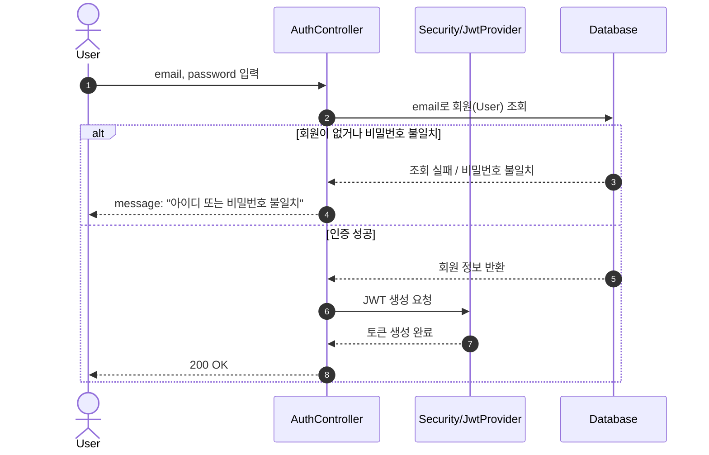
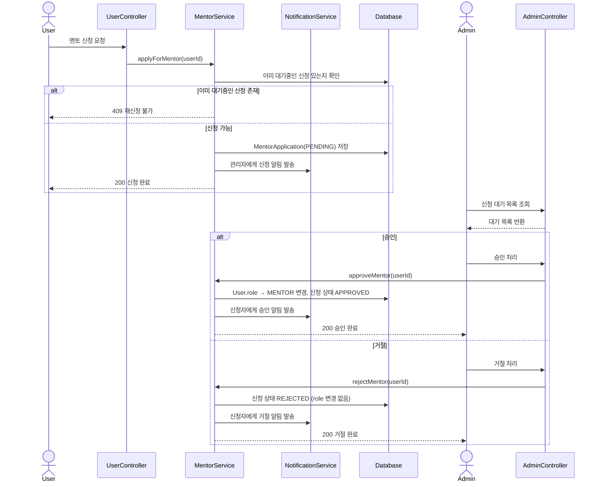
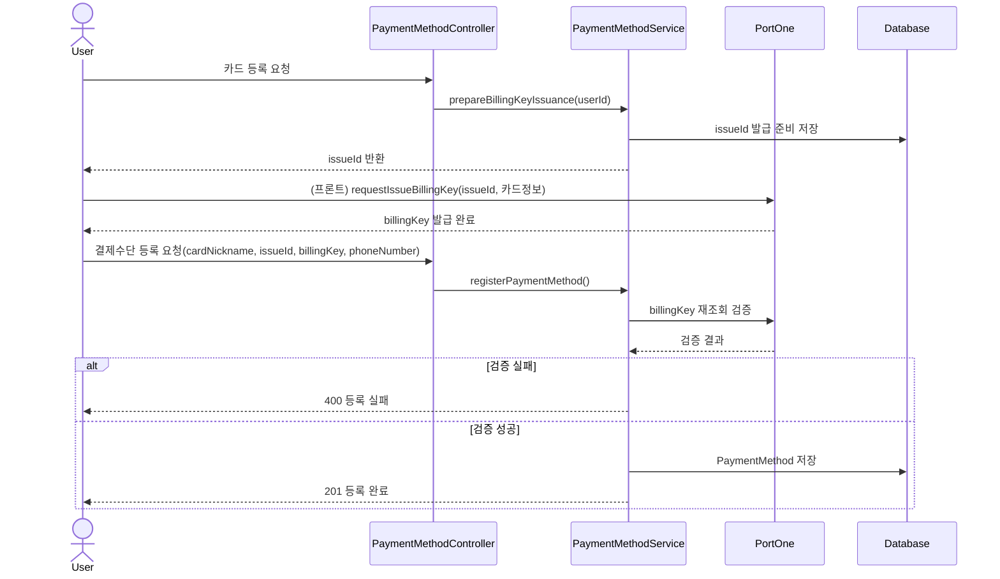
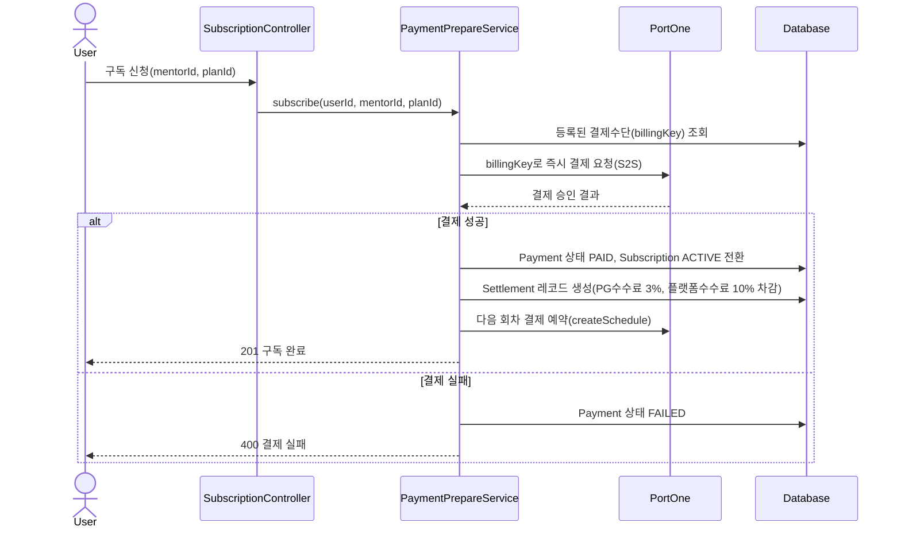
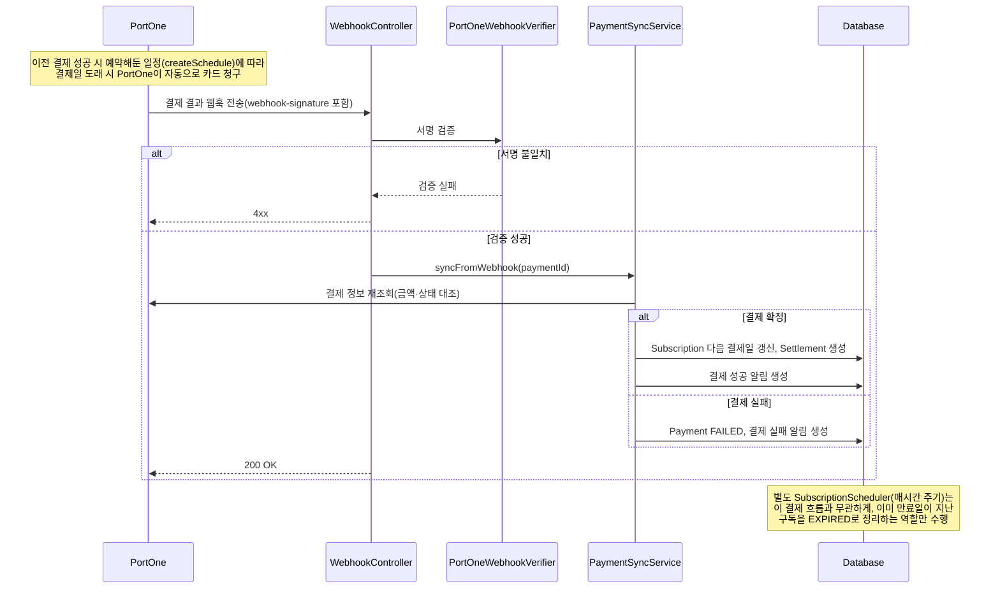
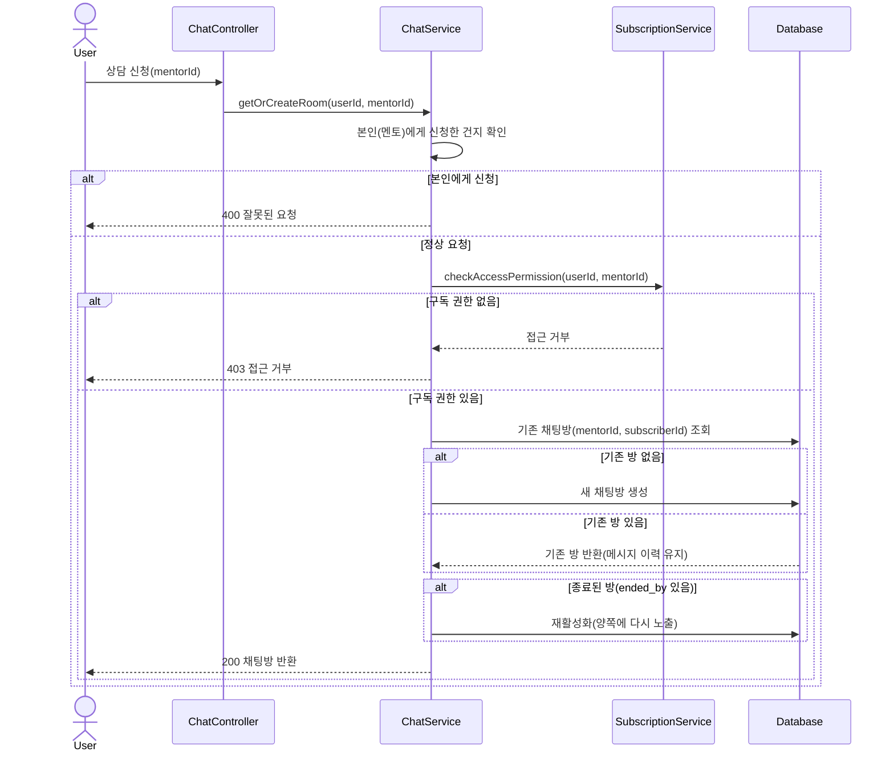
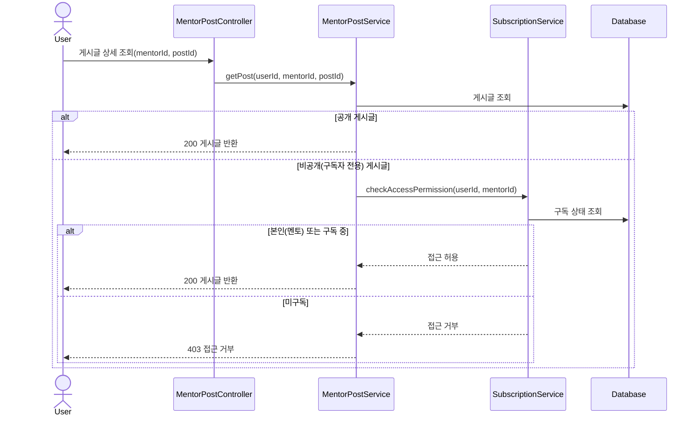
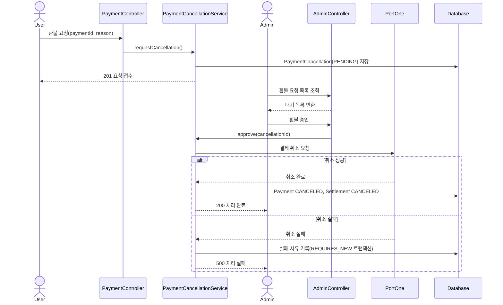
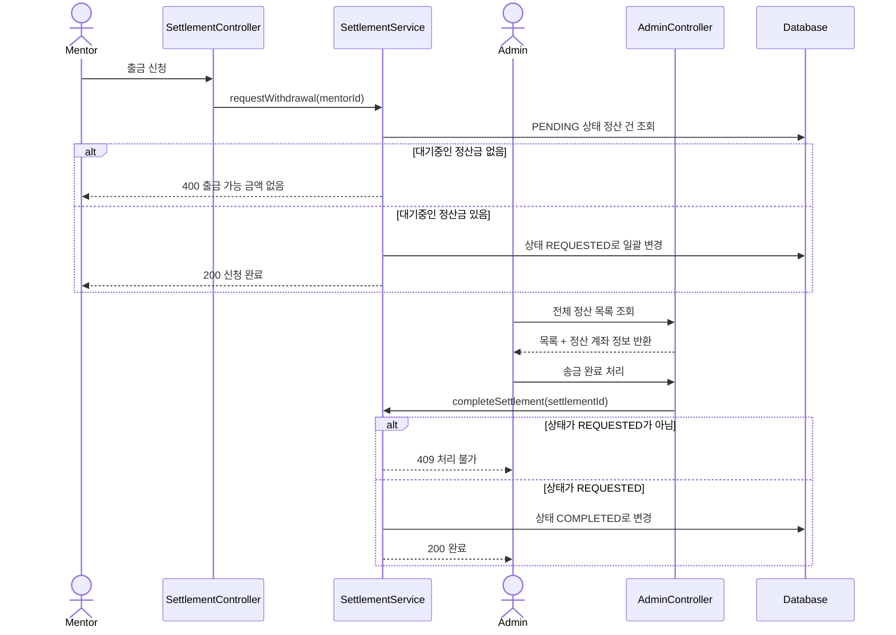

# MVP1: 로그인 및 JWT 토큰 발급

# **MVP1: 멘토 신청 및 관리자 승인/거절**

# **MVP2: 결제수단(빌링키) 등록**

# **MVP2: 구독 신청 및 최초 결제**

# **MVP2: 정기 결제 자동 갱신**

# **MVP2: 채팅방 생성 및 재활성화**

# **MVP2: 구독자 전용 게시글(멘토 게시판) 조회 — 페이월 체크**

# **MVP2: 환불 요청 및 관리자 승인 처리**

# **MVP2: 멘토 정산 출금 신청 및 관리자 완료 처리**

---